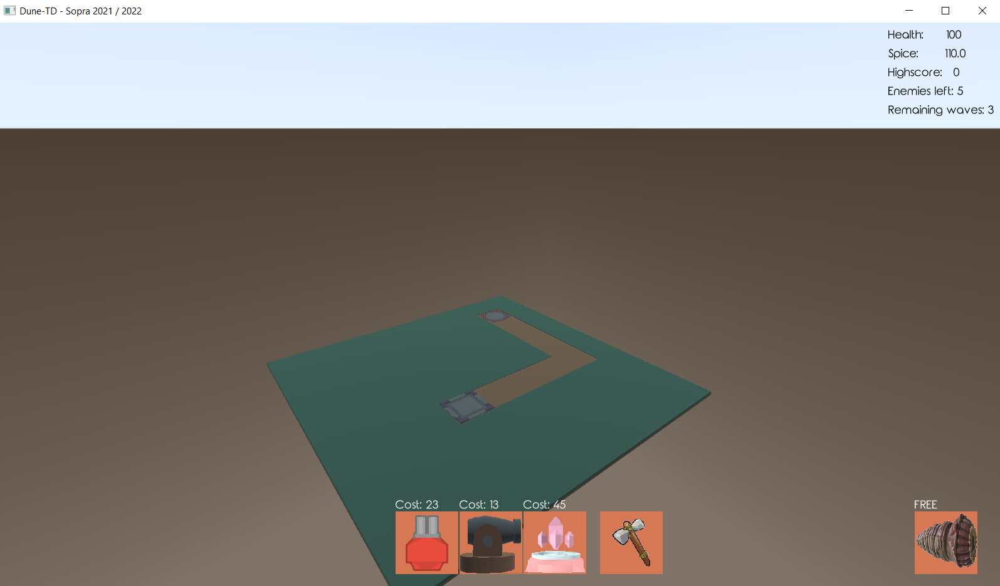
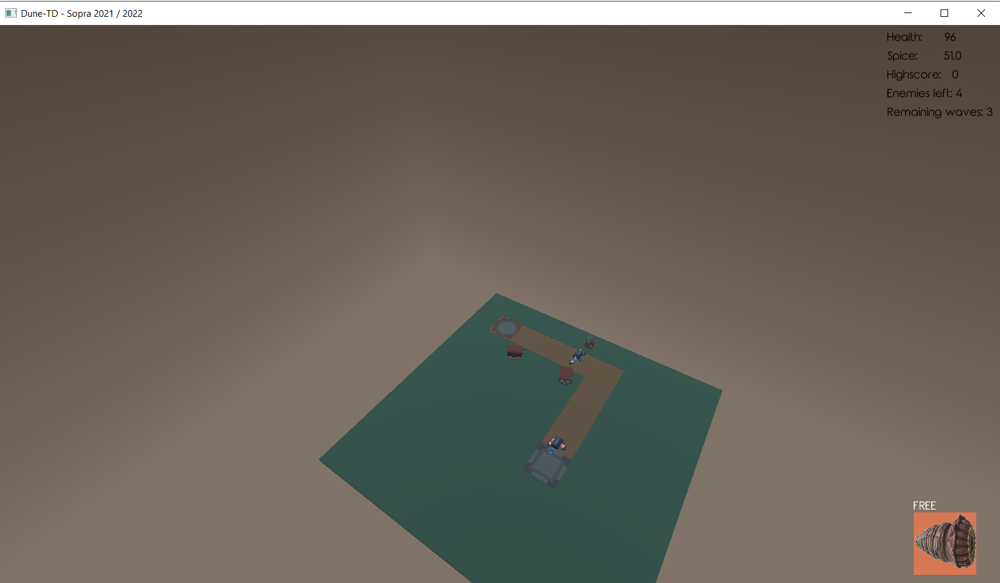
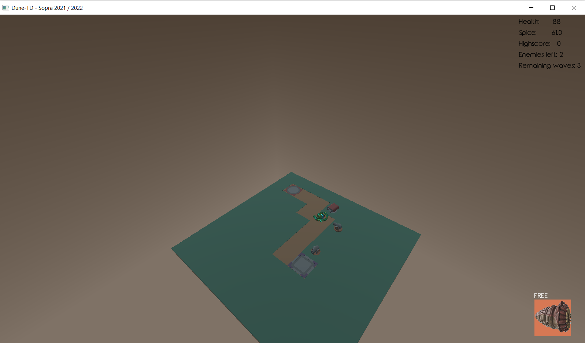
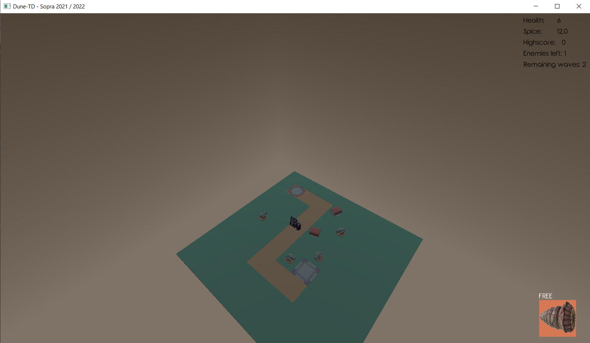
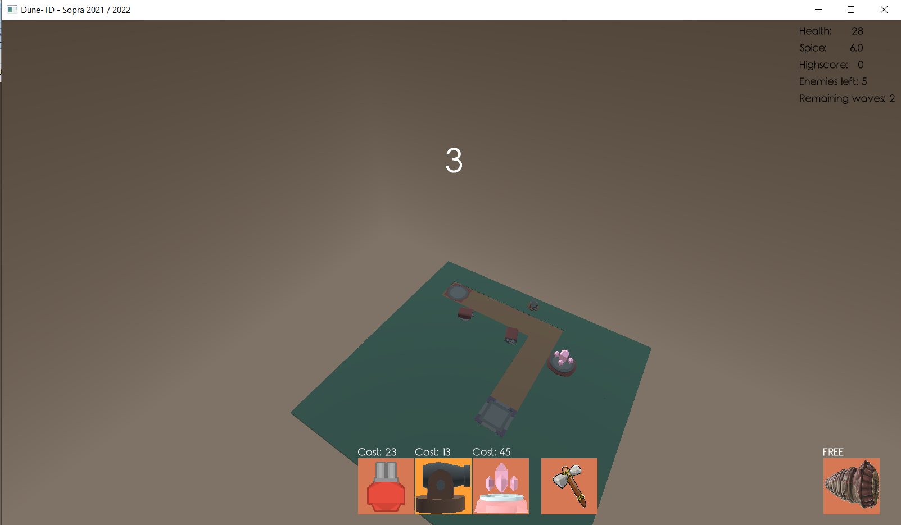

# Dune TowerDefense
A 3D Tower-Defense game created with the LibGDX-framework in Java. Creating this project was mandatory to continue to study Computer Science.  
Please Note: I did the programming of this game, however the graphics were predefined by the University. I don not think they are good looking, but as I am studying Computer Science and had not enough time to design graphics by my own, the game looks the way it looks. If you are looking more into visual stunning games, you should take a look at (Arbalest)[https://github.com/LeverageAlex/Arbalest], a game i did together with some graphic designers.  
At the beginning of the game the Player starts with an fixed amount of spice, which is the currency of the game. The player proceeds to buy Canontowers, Bombtowers and Sonictowers to prevent enemy units from reaching the target field.

